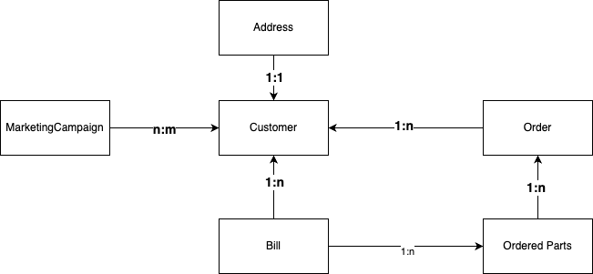

# Typescript ORM and SQL Query builder benchmark

## Purpose

To learn typescript, and NestJS by doing, I was looking for a project to implement. While researching what ORMs are used usually in Node.js applications, it became clear that a few options seem viable at first glance, but I was not able to find a comprehensive (and up-to-date) benchmark of their performance. After reading up on real performance problems with a few of them, like Prisma, I decided to build my own benchmark project, to explore, learn and maybe later open-source comprehensive results of benchmarking the different libraries.

I started with Drizzle since there seemed to be a lot of hype around it's performance and simplicity.

Ideally this will enable people to checkout the repo to their machine, configure the database driver they want to be setup against their local or remote database (first step obviously PostgreSQL since supporting multiple drivers will be more work and I want to finish the different ORMs first)

## On the shoulders of giants

The idea for this project stemmed from the fact that I could not find a relevant existing benchmark.
I found a theoretically very good benchmark for this in this [repository](https://github.com/emanuelcasco/typescript-orm-benchmark) by Emanuel Casco. The problem here is, that the last update was 4 years ago - in the meantime new frameworks showed up and others got significant updates.
So building on inspiration from the methodology and comparisons there, I decided to start fresh.

TODO shout out to tutorial creators as well, for Drizzle SakuraDev on youtube (api a bit outdated but concepts still hold true)

## Methodology and Data used

To be able to compare the different libraries, we will use the following assumptions, data model and queries:

1. We want to explore every relevant relation type available: 1:1, 1:n, n:m - in the last case by using a join-table between the related entities.
2. In the current iteration we will look into simple use-cases like uuids as primary key and indices only on foreign keys - in a future iteration composite indices or keys could be interesting to explore as well since that will impact insert performance
3. We want a dataset that's sufficiently big, ideally with entities in the millions.
4. We randomize the size of collections of child-entities a bit, to not just have uniform data insertion - since in real production use-cases different sizes of datasets are to be expected.
5. Statistics and the [Law of Large Numbers](https://en.wikipedia.org/wiki/Law_of_large_numbers) will ensure that we have a normal distribution for entity count so that we can still compare between sufficiently large benchmarks
6. We're interested in insertion performance, performance of selecting big datasets and of updating selected colums for big datasets in bulk
7. All data can be easily deleted to also be able to measure bulk deletions

A simple synthetic use-case to achieve our goals is the following:

- We own an online store that sells parts for an industry that regularly needs to re-order (e.g. for car mechanics)
- The main parent entity in our shop is the customer. A customer has address details assigned in a 1:1-relation
- Every customer has many Orders (1-n relation) and a bill for each order (1-n from customer to bill)
- Every order consists of many ordered parts (1-n) - this will be the biggest insert we do
- Every ordered part is assigned to a bill (1-n from bill to ordered part) with a big update statement. This is the bulk update we want to explore
- All data for a customer needs to be able to be queried. This is where we should be able to see how big selects perform - ideally also when comparing different limits and offsets
- Our marketing department can create marketing campaigns and roll them out to customers - this is where the many-to-many relation will be in place, a customer can be part of multiple campaigns at the same time and campaigns contain multiple customers.



The size of the data needs to be configurable in the environment. The following set of defaults currently seems sensible and is used if no configuration is provided:

- The number of customers is given as parameter when starting the benchmark
- Every customer has an address
- The number of orders is the number of customers multiplied with a factor between 1 and 25
- The number of ordered parts is the number of orders multiplied with a factor between 1 and 10
- The number of bills is equal to the number of orders
- The number of marketing campaigns is the number of customers divided by 100
- The number of customers per marketing campaigns is between 1 and 10

Comparison is done by marking the performance of each database operation and calculating the average, median and 90%-percentile to get meaningful numbers for repeated operations, e.g. chunk inserts/updates

## Dev Setup

Install your dependencies with

```bash
pnpm install
```

You can run either only a postgres db to connect to or a compose setup with a db and dockerized app (
see [Dockerfile](docker/Dockerfile-ts-orm-benchmark) for application container contents)

After your container is up and running, run

```bash
pnpm drizzle-generate
pnpm drizzle-push
```

to generate and apply the database migration scripts to your DB with the drizzle-kit cli

Configure your sizes in the .env file of your repo. The following keys are used:

- ORDER_AMOUNT_FACTOR - max number of orders per customer
- ORDERED_PARTS_FACTOR - max number of ordered parts per order
- MARKETING_CAMPAIGN_DIVISOR - how many marketing campaigns when compared to number of customers
- MARKETING_CAMPAINGS_TO_CUSTOMER_FACTOR - max number of customers that are assigned to one marketing campaign in the joinTable

- CUSTOMER_CHUNK_SIZE chunk size used when chunking inserts of big amounts of customer entities
- ORDER_CHUNK_SIZE chunk size used when chunking inserts of big amounts of order/orderedParts entities

## TODOs

a lot.
first of all: finish benchmark setup and drizzle-testing with the last important step: many-to-many relations in join-tables

afterwards by order of current priority (subject to change):

1. add documentation about methodology, benchmark data model and ways to configure it
2. add Prisma implementation of repositories for first real comparison of performance
3. Check and compare with Prisma experimental feature that actually joins data correctly

unordered:

- Maybe implement a table with a lot of colums to see how inserts there scale when a lot of colums are involved.
- The current implementation runs into Heapspace memory issues due to the dataset being completely generated in advance and therefore not eligible for garbage collection. We could look into generating test data in chunks as we do for inserting.
- add Frontend to actually look at results - this will be a fun project to dive into React, Vite and tailwind-css
- support the following ORMs and query builders:

  typeorm,
  mikro-orm,
  knex,
  kysely,
  objectionjs,
  sequelize
